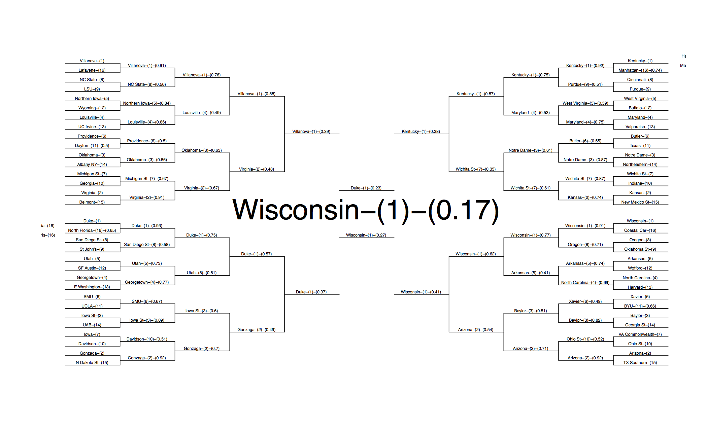

# Introduction
This is the model and compiled data we used to make our predictions in the 2015 Kaggle Tournament. 
The predictions can be predicted (generally), by running the script above. Slight differences may occur in the ultimate bracket that the process predicts because of differences in random seeds and bootstrapping, and because the probability of any given team emerging as the winner are so incredibly slim. 

# To run: 
1. Clone this repo
2. Install any missing/optional packages (listed in first lines of R script as requirements)
3. Change to appropriate directory on line 23 of ncaa_predict.R
4. Set appropriate cores for parallel processing on line 20

# Team:
- Stefan Wojcik
- Joby Schaffer
- Thomas Cook

