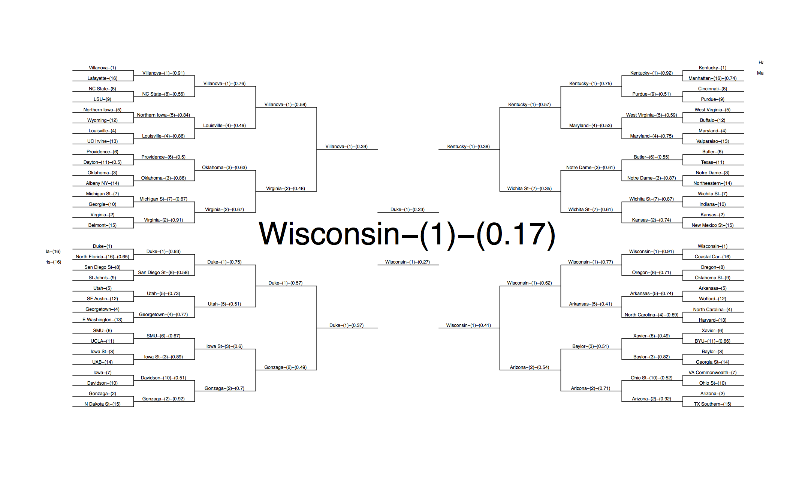

# preliminaries
Load some basic dependencies
```{r eval=FALSE,echo=FALSE}
require('knitr')
opts_chunk$set(eval=FALSE,echo=TRUE,message=FALSE,warning=FALSE,error=FALSE)
knitr:::vweave_docco_classic(file="./ncaa_predict.rmd")
```
```{r}
library(caret)
library(DAMisc)
library(splines)
library(caretEnsemble)
library(foreign)
library(sna)
library(network)
library(psych)
library(doSNOW)
library(parallel)
```

## Optional 

install kaggleNCAA

```{r}
require('devtools')
install_github('zachmayer/kaggleNCAA')
require(kaggleNCAA)
```

to get a phone notification when you run this via boxcar, install tmisc and
insert the appropriate .boxcar_token

```{r}
 require(devtools)
 install_github('trcook/tmisc',subdir='tmisc')
 .boxcar_token<-c("TOKEN_HERE")
 library(tmisc)
```

N threads, set to 0 to turn off parallel processing. Otherwise, set to
appropriate number of cores.

```{r}
ncluster<-4

```

set your directory here:
```{r}
setwd("C:/Users/Thomas/Desktop/NCAA/")
```


# START TRAINING
This is the training process
First we boot up in parallel

```{r}
ivalidate<-read.csv("./ivalidate_pt1.csv")
start<-Sys.time()
if(ncluster>0){
cl<-makeCluster(ncluster)
registerDoSNOW(cl)
}
```

Set some parameters to the training process
```{r}
my_control <- trainControl(
  method='repeatedcv',
  repeats=5,
  savePredictions=TRUE,
  classProbs=TRUE,
  summaryFunction=twoClassSummary
)
```

Run models -- this part takes a while. Specific models we use are listed in the
method-list parameter

```{r}
models <- caretList(
  win~., 
  data=ivalidate[
    ,grepl("win|survscores|powscore|rank|winper|rpi|sos|ncf|orank", 
      names(ivalidate))
    ],
  trControl=my_control,
  methodList=c(
    'bagFDA', 'nnet', 'ada',
    'bayesglm', 'svmPoly','rf',
    'knn', 'svmLinear', 'gbm')
)
```


This will stack the models into an ensemble using a greedy stepwise algorithm
```{r}
stack <- caretStack(models, method='glm')
greedy <- caretEnsemble(models, iter=1000L)

```
Turn off parallel processing
```{r}
if(ncluster>0){
stopCluster(cl)
}
```

Send a handy notification to your phone. The body will have the time it took to
process:

```{r}
end<-Sys.time()
boxcar_notify(
  token = .boxcar_token,
  body = paste("time taken:",
  c(start-end)),title = "Training Done"
  )
```


# Validation Process

Load in our validation dataset

```{r}
ivalidate<-read.csv("./ivalidate_pt2.csv")
```


Make the predictions and get the log loss for the validation set. 
```{r}
preds <- predict(stack, 
  type="prob", 
  newdata = ivalidate[ ,
    grepl(
      "win|survscores|powscore|rank|winper|rpi|sos|ncf|orank",
      names(ivalidate)
    )
  ]
)[,1]

df <- data.frame(
  preds=preds[which(ivalidate$daynum>135)],
  realscore=ivalidate$scorediff[which(ivalidate$daynum>135)],
  season=ivalidate$season[which(ivalidate$daynum>135)]
)
qplot(
  preds, realscore,
  data=df,
  xlab="Prediction",
  ylab="Real Margin") +
  geom_smooth(method="loess")

df$win <- 1*(df$realscore>0)
df$pwin <- 1*(df$preds>=.5)

logloss <- sum(
  (df$win*log(df$preds) +
  (1-df$win)*log(1-df$preds))  * (1/nrow(df)) )
logloss
accuracy <- sum(df$win==df$pwin)/nrow(df) #Make 65% accuracy

```

Calculate Log Loss -- this is the metric by which the contest is judged.

```{r}
CappedBinomialDeviance <- function(a, p) {
  if (length(a) !=  length(p)){
  stop("Actual and Predicted need to be equal lengths!")
  } 
  p_capped <- pmin(0.99, p)
  p_capped <- pmax(0.01, p_capped)
  -sum(a * log(p_capped) + (1 - a) * log(1 - p_capped)) / length(a)
}
CappedBinomialDeviance(df$win, df$preds)
```


# Second Round Training

get final data

```{r}
ivalidate<-read.csv("./ivalidate_pt3.csv")
```


Start up parallel processing 

```{r}
start<-Sys.time()
if(ncluster>0){
cl<-makeCluster(ncluster)
registerDoSNOW(cl)
}

```

set parameters for  models:

```{r}
my_control <- trainControl(
  method='repeatedcv',
  repeats=5,
  savePredictions=TRUE,
  classProbs=TRUE,
  summaryFunction=twoClassSummary
)
```

run models
```{r}
models <- caretList(
  win~., data=ivalidate[,
    grepl(
      "win|survscores|powscore|rank|winper|rpi|sos|ncf",
      names(ivalidate)
    )
  ],
  trControl=my_control,
  methodList=c(
    'bagFDA', 'nnet','ada', 'bayesglm',
    'svmPoly', 'rf','knn', 'svmLinear','gbm'
  )#
)

```


This will stack the models into an ensemble using a greedy stepwise algorithm

```{r}
stack <- caretStack(models, method='glm')
greedy <- caretEnsemble(models, iter=1000L)

```

turn off parallel processing:
```{r}
if(ncluster>0){
stopCluster(cl)
}

```

send notification to phone:
```{r}
end<-Sys.time()
boxcar_notify(
  token = .boxcar_token,
  body = paste("time taken:",c(start-end)),
  title = "Final Training Done")
```


# Final Round Predictions:

Get final round data:

```{r}
ivalidate<-read.csv("./ivalidate_pt4.csv")
df2<-read.csv("./df2.csv")
df<-read.csv("./df.csv")
```


CREATE PREDICTIONS FOR EVERY MATCH-UP FOR STAGE 2

```{r}
preds <- predict(stack, type="prob",
  newdata = df2[,
    grepl(
      "win|survscores|powscore|rank|winper|rpi|sos|ncf|orank",
      names(df2)
    )
  ]
)[,2]
```

put in data.frame

```{r}
finaldf <- data.frame(id=df$id, pred=1-preds)
write.csv(finaldf, "./stage2_n2.csv", row.names=F)
```

generate a comparision of predictions against seed-based predictions:

```{r}
d1 <- read.csv("./kaggle_submission_public.csv")
d2 <- read.csv("./stage2_n2.csv"); names(d2)[2] <- "mypred"
dat <- merge(d1, d2, by="id")
qplot(mypred, pred, data=dat)
```


# Generate bracket

From the kaggleNCAA package (install with install_github('zachmayer/kaggleNCAA'))

```{r}
dat<-parseBracket("./stage2_n2.csv")
setnames(dat,names(dat),c("season", "team_2", "team_1", "pred"))
bracket <- walkTourney(dat, year=2015)
printableBracket(bracket)
```
